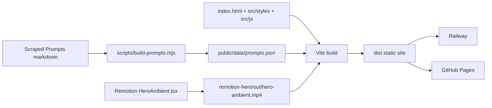

# AI Framework GB — AI Spark newsletter site

A pastel, interactive static site for helping employees learn AI through a newsletter, prompt library, and Remotion-powered ambient hero visuals.

The current app keeps the original visual language and micro-interactions while moving away from a monolithic HTML file:

- **Vite static build** for fast local development and deployable `dist/` output
- **Modular source** in `src/` for HTML, CSS, and browser interactivity
- **Generated prompt data** from `Scraped Prompts/` into `public/data/prompts.json`
- **Interactive framework demos** for prompt building, reusable snippets, and subscription validation
- **Remotion ambient video** preserved as a static asset under `remotion-hero/out/`
- **Railway + GitHub Pages workflows** still serve a static production build

## Run locally

```bash
npm install
npm start
```

`npm start` builds the Vite site when `dist/` is missing, renders `remotion-hero/out/hero-ambient.mp4` only when the file is missing or invalid, and serves the production build at <http://localhost:5173/>.

Set `SKIP_REMOTION_RENDER=1` to keep CI/deploy builds moving without rendering the video; the CSS hero remains the fallback if the MP4 is not present.

For live web development plus Remotion Studio:

```bash
npm run dev
```

For web-only development:

```bash
npm run dev:web
```

To force a Remotion re-render after editing the composition:

```bash
npm run force-render
```

## Quality commands

```bash
npm run lint
npm run lint:styles
npm run format:check
npm run typecheck
npm run test:remotion
npm run scan:secrets
npm run build
npx --yes @lhci/cli@0.14.0 autorun

# Browser tests start the Vite dev server via Playwright
npm run test:e2e
```

A Husky pre-commit hook runs `npm run lint:staged` for JS/TS, CSS, and formatted content. Lighthouse CI reads `lighthouserc.cjs` and fails GitHub Pages builds below the configured performance, accessibility, best-practices, and SEO budgets. Playwright covers hero navigation, prompt library interaction, the framework demo, subscription validation, and dark-mode persistence.

## Deploy

The same repo deploys to **Railway** and **GitHub Pages**. Both targets build the Vite output and serve static files from `dist/`; neither runs Remotion at request time.

### Railway

`railway.json` + `nixpacks.toml` tell Railway to:

1. Install Node 20, Chromium, and ffmpeg dependencies for Remotion.
2. Run `npm install --prefer-offline --no-audit --no-fund` with the npm cache pinned to `/root/.npm` for faster repeat builds.
3. Run `npm run build` to generate prompt data, conditionally render the hero video, build Vite, and copy Remotion output into `dist/`.
4. Run `npm run start:railway` to serve `dist/` on `$PORT`.

### GitHub Pages

1. In repo settings: Pages → Build and deployment → Source: **GitHub Actions**.
2. Push to `main` or `master`.
3. `.github/workflows/deploy-pages.yml` restores npm caches for both lockfiles, installs dependencies with `npm ci --prefer-offline`, installs Chromium for Playwright, runs lint/style/format/typecheck/remotion/secret/e2e quality gates, runs `npm run build`, checks the Lighthouse CI budget, uploads `dist/`, and publishes the site.

The published URL is typically `https://<username>.github.io/<repo>/`.

## Project layout

```text
index.html                    # Vite HTML entry with static sections and module script
src/
  styles/main.css             # Extracted visual system and responsive styles
  js/main.js                  # Browser interactions and prompt-library logic
public/data/prompts.json      # Generated prompt library data served as a static asset
scripts/build-prompts.mjs     # Converts Scraped Prompts markdown into prompt JSON
scripts/start.js              # One-command production-build runner
scripts/render-if-needed.mjs   # Conditional Remotion render used by build/deploy
lighthouserc.cjs               # Lighthouse CI budgets for Pages workflow
remotion-hero/                # Remotion ambient hero composition and rendered output
  src/HeroAmbient.tsx
  out/hero-ambient.mp4
Scraped Prompts/              # Source markdown prompt packs
dist/                         # Generated Vite production build, not committed
.github/workflows/            # GitHub Pages deployment
railway.json / nixpacks.toml  # Railway static build and runtime config
```

## Architecture



## Positioning

**AI Spark** is the friendly employee-facing layer of the AI Framework GB enablement kit. It combines a monthly newsletter, a beginner learning path, safe-use reminders, and a searchable prompt library so non-technical teams can adopt AI without turning the site into a generic tool directory.

## Hero interaction preview

The Remotion ambient hero remains a static deploy artifact, not an inline/base64 asset.

- Generated hero video: [`remotion-hero/out/hero-ambient.mp4`](remotion-hero/out/hero-ambient.mp4)
- Hero source composition: [`remotion-hero/src/HeroAmbient.tsx`](remotion-hero/src/HeroAmbient.tsx)
- Social preview artwork: [`public/og-image.svg`](public/og-image.svg)

## Customization guide

### Hero copy and content

- Update the visible hero copy in `<section id="hero">` inside `index.html`.
- Keep the short, warm, employee-first tone: practical examples, low jargon, and one clear call to action.
- Update footer and meta copy together so search/social snippets match the on-page positioning.

### Colors and visual language

- Page tokens live near the top of `src/styles/main.css` as CSS custom properties.
- Preserve the pastel warmth by changing variables rather than hard-coding one-off colors in sections.
- Keep the dark theme values paired with light theme values under `[data-theme="dark"]`.

### Motion and timing

- Remotion animation timing and ambient shapes: `remotion-hero/src/HeroAmbient.tsx`.
- Browser micro-interactions and reduced-motion behavior: `src/js/main.js` plus the `prefers-reduced-motion` block in `src/styles/main.css`.
- Keep the Remotion video as a static asset; do not embed it as base64.

### Prompt library and framework demos

- Add or edit markdown prompt packs in `Scraped Prompts/`.
- Run `npm run build:prompts` to regenerate `public/data/prompts.json`.
- Keep prompt titles action-oriented so the filters remain easy to scan.
- Edit the prompt playground templates in `PLAYGROUND_TASKS` inside `src/js/main.js`.
- Connect the subscription form to a real email service by replacing the front-end success state in `setupSubscribeForm()`.

## Contribution guidelines

1. Create a feature branch from the active base branch.
2. Run `npm install` if dependencies changed, then use `npm run dev:web` for site-only development.
3. Before committing, run the relevant quality checks: `npm run lint`, `npm run lint:styles`, `npm run format:check`, and `npm run typecheck`.
4. Use conventional commits such as `feat:`, `fix:`, `perf:`, `docs:`, or `test:`.
5. Do not commit generated `dist/` output, secrets, local environment files, or base64-embedded media.
6. Keep Railway and GitHub Pages workflows backward-compatible unless a deployment change is intentional and documented.

## SEO files

- `public/sitemap.xml` advertises the canonical GitHub Pages URL and key content anchors.
- `public/robots.txt` allows indexing and points crawlers to the sitemap.
- `public/og-image.svg` provides a lightweight social preview image that matches the pastel aesthetic.

## What's New

- The 3.7 MB monolithic HTML file has been split into a small Vite entry, extracted CSS, modular JS, and viewport-triggered prompt data.
- Prompt data is now regenerated from the markdown source library instead of living inline in the page.
- Deployment workflows now publish the built `dist/` artifact while preserving Railway and GitHub Pages compatibility.
- Build output is minified with stable hashed asset names, the prompt library loads only near interaction, celebratory confetti is split into an on-demand chunk, Railway uses npm cache-aware installs, and GitHub Pages runs Lighthouse CI budgets.
- Accessibility now includes skip navigation, semantic sections, ARIA state management, keyboard-friendly starter steps, reduced-motion support, and mobile layout refinements.
- SEO now includes canonical metadata, Open Graph/Twitter cards, JSON-LD structured data, sitemap/robots files, and matching social preview artwork.
- Feature polish now includes a searchable/copyable prompt library, live prompt playground, reusable prompt recipe card, pastel framework card, persistent dark mode, and validated subscription demo.
- Tooling now includes Playwright browser coverage, a Remotion render asset test, secret scanning, Dependabot npm updates, newer Remotion packages, and clearer `npm start` diagnostics.
- ESLint, Prettier, Stylelint, TypeScript checks, lint-staged, and Husky are configured for maintainable changes.
