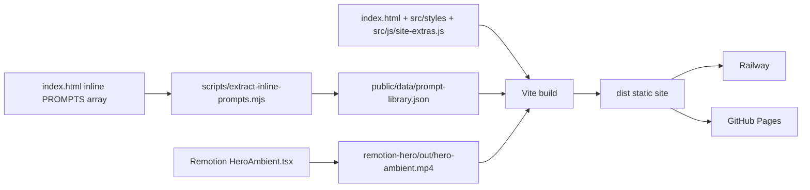

# AI Framework GB — AI Spark newsletter site

A pastel, interactive static site that helps employees learn AI through a
beginner learning path, a prompt builder, safety templates, and a searchable
875-prompt library, with a Remotion-powered ambient hero loop.

## Architecture honesty

The site is currently a **single large static `index.html` (~5,000 lines,
~217 KB)** that imports an extracted CSS file plus one ES module for PWA
and Web Vitals. The bulk of the page-level UI logic still lives in two
inline `<script>` blocks inside `index.html`. The files under `src/js/`
(`main.js`, `try-it.js`, `confetti.js`) are the **rehydration target** for
when that inline logic is migrated out — they are not the production
runtime today, except for `site-extras.js` (PWA + Web Vitals), which is
loaded as a module from the page.

What ships in the build:

- **Vite static build** producing a deployable `dist/`
- **Extracted CSS** in `src/styles/main.css`
- **Inline page logic** in `index.html` (migration in progress)
- **One real module** loaded from the page: `src/js/site-extras.js`
- **Lazy-fetched prompt data** at `public/data/prompt-library.json`
  (875 prompts, ~3.5 MB raw JSON, gzipped on transit)
- **Remotion ambient hero video** baked at build time into
  `remotion-hero/out/hero-ambient.mp4`
- **Railway + GitHub Pages** static deploys from the same `dist/`

## Run locally

```bash
npm install
npm start
```

`npm start` builds the Vite site when `dist/` is missing, renders
`remotion-hero/out/hero-ambient.mp4` only when the file is missing or
invalid, and serves the production build at <http://localhost:5173/>.

Set `SKIP_REMOTION_RENDER=1` to keep CI/deploy builds moving without
rendering the video; the CSS hero remains the fallback if the MP4 is
not present.

For live web development plus Remotion Studio:

```bash
npm run dev
```

For web-only development:

```bash
npm run dev:web
```

To force a Remotion re-render after editing the composition:

```bash
npm run force-render
```

## Quality commands

```bash
npm run lint
npm run lint:styles
npm run format:check
npm run typecheck
npm run test:remotion
npm run scan:secrets
npm run build
npx --yes @lhci/cli@0.14.0 autorun

# Browser tests start the Vite dev server via Playwright
npm run test:e2e
```

A Husky pre-commit hook runs `npm run lint:staged` for JS/TS, CSS, and
formatted content. Lighthouse CI reads `lighthouserc.cjs` and fails
GitHub Pages builds below the configured performance, accessibility,
best-practices, and SEO budgets. Playwright covers hero navigation,
prompt library interaction, the framework demo, subscription validation,
and dark-mode persistence.

## Deploy

The same repo deploys to **Railway** and **GitHub Pages**. Both targets
build the Vite output and serve static files from `dist/`; neither runs
Remotion at request time.

### Railway

`railway.json` + `nixpacks.toml` tell Railway to:

1. Install Node 20, Chromium, and ffmpeg dependencies for Remotion.
2. Run `npm install --prefer-offline --no-audit --no-fund` with the npm
   cache pinned to `/root/.npm` for faster repeat builds.
3. Run `npm run build` to conditionally render the hero video, build
   Vite, and copy Remotion output into `dist/`.
4. Run `npm run start:railway` to serve `dist/` on `$PORT`.

### GitHub Pages

1. In repo settings: Pages → Build and deployment → Source:
   **GitHub Actions**.
2. Push to `main` or `master`.
3. `.github/workflows/deploy-pages.yml` restores npm caches for both
   lockfiles, installs dependencies with `npm ci --prefer-offline`,
   installs Chromium for Playwright, runs lint/style/format/typecheck/
   remotion/secret/e2e quality gates, runs `npm run build`, checks the
   Lighthouse CI budget, uploads `dist/`, and publishes the site.

The published URL is typically `https://<username>.github.io/<repo>/`.

## Project layout

```text
index.html                       # Vite HTML entry — most page logic lives here (inline)
src/
  styles/main.css                # Extracted visual system and responsive styles
  js/site-extras.js              # PWA + Web Vitals module loaded from the page
  js/main.js                     # Rehydration target (NOT loaded by index.html yet)
  js/try-it.js                   # Try-it widget logic, mirrored to inline script
  js/confetti.js                 # Lazy-loaded celebratory animation
public/data/prompt-library.json  # Lazy-fetched 875-prompt library
scripts/
  start.js                       # One-command production-build runner
  render-if-needed.mjs           # Conditional Remotion render used by build/deploy
  extract-inline-prompts.mjs     # One-shot extractor used to seed prompt-library.json
  inline-prompts-loader.mjs      # Helper for the prompt loader migration
  secret-scan.mjs                # Pre-commit/CI secret scan
  visual-audit.mjs / dom-audit.mjs / newsletter-probe.mjs
                                 # Local QA helpers
  extract-inline-css.mjs         # One-shot extractor used to seed src/styles/main.css
  _mobile-screenshot.mjs         # Local screenshot helper
lighthouserc.cjs                 # Lighthouse CI budgets for Pages workflow
remotion-hero/                   # Remotion ambient hero composition + rendered output
  src/HeroAmbient.tsx
  out/hero-ambient.mp4
Scraped Prompts/                 # Source markdown prompt packs (see attribution)
dist/                            # Generated Vite production build, not committed
.github/workflows/               # GitHub Pages deployment
railway.json / nixpacks.toml     # Railway static build and runtime config
```

## Architecture



## Positioning

**AI Spark** is the friendly employee-facing layer of the AI Framework GB
enablement kit. It combines a monthly newsletter, a beginner learning
path, safe-use reminders, and a searchable prompt library so non-technical
teams can adopt AI without turning the site into a generic tool directory.

## Hero interaction preview

The Remotion ambient hero remains a static deploy artifact, not an
inline/base64 asset.

- Generated hero video: [`remotion-hero/out/hero-ambient.mp4`](remotion-hero/out/hero-ambient.mp4)
- Hero source composition: [`remotion-hero/src/HeroAmbient.tsx`](remotion-hero/src/HeroAmbient.tsx)
- Social preview artwork: [`public/og-image.svg`](public/og-image.svg)

## Customization guide

### Hero copy and content

- Update the visible hero copy in `<section id="hero">` inside `index.html`.
- Keep the short, warm, employee-first tone: practical examples, low
  jargon, and one clear call to action.
- Update footer and meta copy together so search/social snippets match
  the on-page positioning.

### Colors and visual language

- Page tokens live near the top of `src/styles/main.css` as CSS custom
  properties.
- Preserve the pastel warmth by changing variables rather than
  hard-coding one-off colors in sections.
- Keep the dark theme values paired with light theme values under
  `[data-theme="dark"]`.

### Motion and timing

- Remotion animation timing and ambient shapes:
  `remotion-hero/src/HeroAmbient.tsx`.
- Browser micro-interactions and reduced-motion behavior: the inline
  scripts in `index.html` plus the `prefers-reduced-motion` block in
  `src/styles/main.css`.
- Keep the Remotion video as a static asset; do not embed it as base64.

### Prompt library and framework demos

- The 875-prompt library lives in `public/data/prompt-library.json` and
  is fetched lazily from the page when the prompt section nears the
  viewport (or on browser idle).
- To regenerate it from the inline `const PROMPTS = [...]` literal in
  `index.html`, run `node scripts/extract-inline-prompts.mjs`.
- Add or edit markdown prompt packs under `Scraped Prompts/` for
  reference and authoring; the live page reads from the JSON above.
- Edit the prompt playground templates in `PLAYGROUND_TASKS` inside the
  inline script in `index.html` (mirrored in `src/js/try-it.js`).
- Connect the subscription form to a real email service by replacing
  the front-end success state in `setupSubscribeForm()`.

## Attribution

The markdown prompt packs under `Scraped Prompts/` were collected from
[AI Fiesta community courses](https://community.aifiesta.ai/web/courses)
and adapted for internal employee enablement. Treat them as reference
material; verify usage rights before any external redistribution.

## Contribution guidelines

1. Create a feature branch from the active base branch.
2. Run `npm install` if dependencies changed, then use `npm run dev:web`
   for site-only development.
3. Before committing, run the relevant quality checks: `npm run lint`,
   `npm run lint:styles`, `npm run format:check`, and `npm run typecheck`.
4. Use conventional commits such as `feat:`, `fix:`, `perf:`, `docs:`,
   or `test:`.
5. Do not commit generated `dist/` output, secrets, local environment
   files, or base64-embedded media.
6. Keep Railway and GitHub Pages workflows backward-compatible unless a
   deployment change is intentional and documented.

## SEO files

- `public/sitemap.xml` advertises the canonical GitHub Pages URL and key
  content anchors.
- `public/robots.txt` allows indexing and points crawlers to the sitemap.
- `public/og-image.svg` provides a lightweight social preview image that
  matches the pastel aesthetic.

## Known debt (be honest)

- **Inline scripts:** `index.html` still owns ~2 large inline `<script>`
  blocks and ~70 inline `onclick`/`onchange`/`onkeydown` handlers. This
  blocks a strict CSP and makes diffs noisy. The `src/js/main.js` module
  is the planned destination; existing tests assert handler **names** in
  HTML, so the migration also needs a test refactor.
- **Prompt payload:** `prompt-library.json` ships as a single ~3.5 MB
  array. Filtering / rendering all live off the in-memory array, so
  chunking by category is an additive optimization (manifest + lazy
  per-category fetch) rather than a behavior change.
- **Subscribe form:** the newsletter UI validates and shows a success
  state but has no backend wired in yet.
- **Web Vitals collection:** `src/js/web-vitals.js` collects metrics but
  has no remote sink configured.
