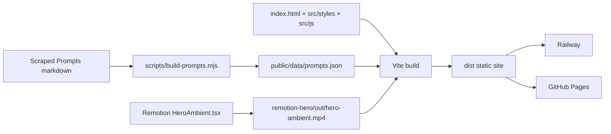

# AI Framework GB — AI Spark newsletter site

A pastel, interactive static site for helping employees learn AI through a newsletter, prompt library, and Remotion-powered ambient hero visuals.

The current app keeps the original visual language and micro-interactions while moving away from a monolithic HTML file:

- **Vite static build** for fast local development and deployable `dist/` output
- **Modular source** in `src/` for HTML, CSS, and browser interactivity
- **Generated prompt data** from `Scraped Prompts/` into `public/data/prompts.json`
- **Remotion ambient video** preserved as a static asset under `remotion-hero/out/`
- **Railway + GitHub Pages workflows** still serve a static production build

## Run locally

```bash
npm install
npm start
```

`npm start` builds the Vite site when `dist/` is missing, renders `remotion-hero/out/hero-ambient.mp4` only if needed, and serves the production build at <http://localhost:5173/>.

For live web development plus Remotion Studio:

```bash
npm run dev
```

For web-only development:

```bash
npm run dev:web
```

To force a Remotion re-render after editing the composition:

```bash
npm run force-render
```

## Quality commands

```bash
npm run lint
npm run lint:styles
npm run format:check
npm run typecheck
npm run build
```

A Husky pre-commit hook runs `npm run lint:staged` for JS/TS, CSS, and formatted content.

## Deploy

The same repo deploys to **Railway** and **GitHub Pages**. Both targets build the Vite output and serve static files from `dist/`; neither runs Remotion at request time.

### Railway

`railway.json` + `nixpacks.toml` tell Railway to:

1. Install Node 20, Chromium, and ffmpeg dependencies for Remotion.
2. Run `npm install --no-audit --no-fund`.
3. Run `npm run build` to generate prompt data, render the hero video if missing, build Vite, and copy Remotion output into `dist/`.
4. Run `npm run start:railway` to serve `dist/` on `$PORT`.

### GitHub Pages

1. In repo settings: Pages → Build and deployment → Source: **GitHub Actions**.
2. Push to `main` or `master`.
3. `.github/workflows/deploy-pages.yml` installs dependencies, runs `npm run build`, uploads `dist/`, and publishes the site.

The published URL is typically `https://<username>.github.io/<repo>/`.

## Project layout

```text
index.html                    # Vite HTML entry with static sections and module script
src/
  styles/main.css             # Extracted visual system and responsive styles
  js/main.js                  # Browser interactions and prompt-library logic
public/data/prompts.json      # Generated prompt library data served as a static asset
scripts/build-prompts.mjs     # Converts Scraped Prompts markdown into prompt JSON
scripts/start.js              # One-command production-build runner
remotion-hero/                # Remotion ambient hero composition and rendered output
  src/HeroAmbient.tsx
  out/hero-ambient.mp4
Scraped Prompts/              # Source markdown prompt packs
dist/                         # Generated Vite production build, not committed
.github/workflows/            # GitHub Pages deployment
railway.json / nixpacks.toml  # Railway static build and runtime config
```

## Architecture



## Customizing the hero

- Animation colors and timing: `remotion-hero/src/HeroAmbient.tsx`
- Hero copy and markup: `<section id="hero">` in `index.html`
- Hero visual styling: `src/styles/main.css`
- Hero and page interactions: `src/js/main.js`

Keep the Remotion video as a static asset; do not embed it as base64.

## What's New

- The 3.7 MB monolithic HTML file has been split into a small Vite entry, extracted CSS, modular JS, and lazy-loaded prompt data.
- Prompt data is now regenerated from the markdown source library instead of living inline in the page.
- Deployment workflows now publish the built `dist/` artifact while preserving Railway and GitHub Pages compatibility.
- ESLint, Prettier, Stylelint, TypeScript checks, lint-staged, and Husky are configured for maintainable changes.
